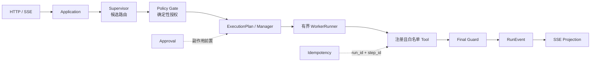
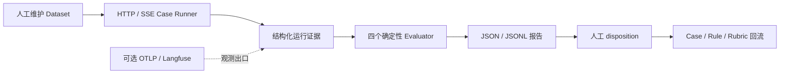

# Eino Supervisor Template

这是一个 Go/Eino Agent 参考模板，包含确定性的 Policy Gate、审批、幂等、可恢复执行和版本化评测集。

它是可运行的工程样例，不是生产级 Agent 平台。服务默认使用 DeepSeek（API key 从环境变量读取）；fake 模型、合成数据和本地存储用于无外部依赖的合同验证，不连接真实 CRM 或营销渠道。

## 五分钟看懂

### 项目解决什么问题

模型输出即使结构正确，也可能越权调用 Tool、绕过审批、重复产生副作用，或在恢复时重复执行。本项目把模型输出限制为候选路由，把权限、状态、审批、幂等、终态和公开事件交给确定性代码，再用 HTTP/SSE Case Runner 和报告验证入口行为。

### 运行链路



- Application/Manager 持有运行状态和执行计划。
- Supervisor 只能提出候选 Worker、Tool 和参数；Policy Gate 决定是否允许。
- 副作用必须经过 `Policy Gate -> Approval -> Idempotency -> Tool -> Audit Event`。
- Worker 没有最终答复权；Domain 不依赖 HTTP、Eino、数据库、MCP、模型或 SSE。

目录职责和依赖方向见 [docs/architecture.md](./docs/architecture.md)。

### 评测闭环



Langfuse 只承载可选观测和运行评测证据，不拥有业务状态，也不决定审批、幂等、终态或权限。默认本地评测不需要 Langfuse、数据库、Apifox、真实模型或网络凭证；服务默认使用 DeepSeek，`.env`/环境变量可以覆盖 provider。

## 架构防腐落点

| 风险 | 确定性约束 | 代码/验证落点 | 状态 |
| --- | --- | --- | --- |
| 模型越权调用 Tool | 注册表、Worker allow-list、Policy Gate | `internal/domain/agent`、composition 合同测试、architecture evaluator | `implemented` |
| 未审批产生副作用 | Approval 前不构造/执行副作用 Tool | `boundary-approved-outreach`、`negative-reject-outreach`、fake write count | `implemented` |
| 重复恢复造成重复写入 | `run_id + step_id` 幂等键 | 重复 resume 合同测试和高风险 Case | `implemented` |
| 运行状态多人维护 | Application/Manager 是唯一 owner | `internal/application/run`、架构文档和测试 | `implemented` |
| 提交前中断导致未知结果 | `RUN_OUTCOME_UNKNOWN`，不自动重试 | `TestUnknownRunnerOutcomeWaitsForReconciliationAndNeverRetries` | `implemented` |
| 未注册能力被调用 | 启动期注册校验，失败关闭 | `RuntimeCatalog`、`cmd/archcheck`、CI | `implemented` |
| 跨层依赖被改坏 | `interfaces -> application -> domain` | `cmd/archcheck` + `.github/workflows/ci.yml` | `implemented` |
| 观测后端故障改变业务结果 | exporter/log/snapshot 走 degraded signal | observability 合同测试 | `implemented` |

CI workflow 已接入架构检查、Go 测试、评测包测试和本地 Case Runner；托管平台的 Required Checks/Required Reviewers 仍需在仓库设置中启用，不能只凭 workflow 文件宣称合并门禁已生效。

## 本地运行

### 1. 运行单元、合同和并发检查

```bash
go test ./...
go test -race ./...
go build ./cmd/server/
go vet ./...
go run ./cmd/archcheck
git diff --check
```

### 2. 跑出一份评测报告

```bash
go run ./cmd/eval \
  -dataset ./eval/datasets/synthetic-operations-v1.json \
  -report ./tmp/eval-report.json \
  -code-version dev \
  -config ./config.example.toml
```

命令同时保留 JSON 报告，并在终端打印每个 Case 的 `PASS/FAIL`、终态和副作用写入次数，便于快速查看；JSON 报告才是 CI 和后续分析的事实来源。

本命令默认按未知风险安全地跑完整 Dataset。当前 Dataset 有 8 个 Case，覆盖 `positive`、`negative`、`boundary` 和 `diversity`；最近一次本地运行结果为 `passed=8 failed=0`。普通变更可以按影响标签缩小范围：

```bash
go run ./cmd/eval \
  -dataset ./eval/datasets/synthetic-operations-v1.json \
  -report ./tmp/eval-report-low.json \
  -risk low -impact-tags audience-query \
  -code-version dev -config ./config.example.toml
```

该选择实际运行了 3 个 Case，结果为 `passed=3 failed=0`。需要逐 Case 回放时增加 `-jsonl ./tmp/eval-report.jsonl`。

退出码含义：

- `0`：选中的 Case 全部通过四个硬评测维度；
- `1`：运行成功但业务、架构、副作用或稳定性硬断言失败；
- `2`：Dataset、配置或 Runner 装配失败。

报告保留 Dataset/Case 版本、`code_version`、`run_id`、HTTP 状态、事件顺序、Tool/Approval/终态证据、trace ID、重试、fake write count、cleanup 结果、四个 evaluator 的独立结果，以及失败时的 `failed_assertion`、failure taxonomy、evidence reference 和可空 `human_disposition`。定位失败 Case：

```bash
jq '.cases[] | select(.passed == false)' ./tmp/eval-report.json
```

当前 `business_correctness` 硬断言终态、事件顺序及 Case 声明的结构化结果字段；报告只保留这些预期字段，不保存完整 Tool payload。

### 3. 可选启动服务

```bash
go run ./cmd/server/ -f ./config.example.toml
```

`config.example.toml` 默认使用 DeepSeek，根目录 `.env` 或环境变量可覆盖 provider；启动日志会打印实际 `model_provider`。需要无外部模型的 fake smoke 时显式加 `-fake`。服务提供 `/healthz`、`/api/chat`、approval、resume 和 cancel。

## 代表性 Case

1. `positive-serial-summary`：两个已注册 Worker 按固定顺序执行，第二步只消费第一步的有界结果。
2. `negative-reject-outreach`：拒绝审批后进入 `failed`，没有 `tool_call`，fake 写入数保持为 0。
3. `boundary-approved-outreach`：批准后只写入一次，重复 resume 仍保持唯一终态和 `fake_write_count=1`。

完整 Case 定义在 [eval/datasets/synthetic-operations-v1.json](./eval/datasets/synthetic-operations-v1.json)，评测方法在 [docs/evaluation-method.md](./docs/evaluation-method.md)。

## 当前状态

| 能力 | 状态 | 说明 |
| --- | --- | --- |
| 版本化 Dataset、HTTP/SSE Runner、JSON/JSONL 报告 | `implemented` | 本地命令可实际跑通，默认不依赖外部服务 |
| 四类确定性 Evaluator | `implemented` | business、architecture、side-effect、stability 分开报告；业务结果字段按 Case 预期断言 |
| 失败 taxonomy、人工 disposition、Judge 合同 | `partial` | 合同和脱敏 digest 已有；Judge/回流仍由人工触发，不自动改 Dataset |
| `cmd/archcheck` 与 CI workflow | `implemented` | 代码和 workflow 有落点；托管平台 Required Checks 需另行配置 |
| OpenTelemetry / Langfuse 可选出口 | `partial` | 有低基数关联和运行证据；在线 Dataset/Score/Feedback 同步 deferred |
| MySQL/GORM | `partial` | 有 adapter 和本地 smoke；不是默认依赖，也不代表生产 HA |
| 在线 LLM Judge | `deferred` | 不进入默认 CI 硬门禁 |
| Apifox 自动化 | `not_applicable` | 本地验收直接复用真实 HTTP/SSE 路由 |
| 真实 CRM/营销触达 | `deferred` | 当前只有合成 fixture 和 fake Tool |
| 并行 / DAG / 开放式自主循环 | `deferred` | 当前最多两个有序步骤，按需求和指标再扩展 |
| 跨进程 exactly-once | `deferred` | 文件快照不提供数据库级或分布式 exactly-once |

“implemented”只表示当前代码和本地验证达到该范围；真实模型驱动的 Eino Worker ToolCall、跨进程 Eino resume、完整 OIDC/JWT/RBAC 和生产运维语义仍保持 `partial` 或 `deferred`。详见 [docs/current-capability-and-gap-report.md](./docs/current-capability-and-gap-report.md) 和 [PROGRESS.md](./PROGRESS.md)。

## 边界

项目不宣称完整支持多租户平台、画布、插件市场、真实 CRM、并行/DAG、生产级身份、数据库 HA 或跨进程 exactly-once。不要把计划文件的勾选、配置字段存在或 Langfuse exporter 初始化当作实现证据。

## 许可证

本项目原创代码和文档采用 [MIT License](./LICENSE)。第三方依赖按各自许可证使用。
