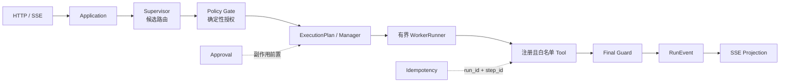
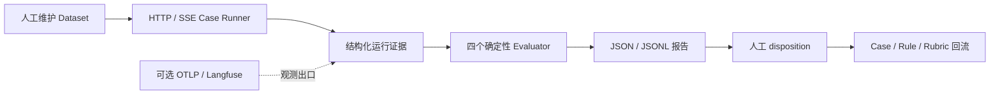

# Eino Supervisor Template

这是一个 Go/Eino Agent 参考模板，包含确定性的 Policy Gate、审批、幂等、可恢复执行和版本化评测集。

它是可运行的工程样例，不是生产级 Agent 平台。服务默认使用 DeepSeek（API key 从环境变量读取）；fake 模型、合成数据和本地存储用于无外部依赖的合同验证，不连接真实 CRM 或营销渠道。

## 五分钟看懂

### 项目解决什么问题

模型输出即使结构正确，也可能越权调用 Tool、绕过审批、重复产生副作用，或在恢复时重复执行。本项目把模型输出限制为候选路由，把权限、状态、审批、幂等、终态和公开事件交给确定性代码，再用 HTTP/SSE Case Runner 和报告验证入口行为。

### 运行链路



- Application/Manager 持有运行状态和执行计划。
- Supervisor 只能提出候选 Worker、Tool 和参数；Policy Gate 决定是否允许。
- 副作用必须经过 `Policy Gate -> Approval -> Idempotency -> Tool -> Audit Event`。
- Worker 没有最终答复权；Domain 不依赖 HTTP、Eino、数据库、MCP、模型或 SSE。

目录职责和依赖方向见 [docs/architecture.md](./docs/architecture.md)。

### 评测闭环



Langfuse 只承载可选观测和运行评测证据，不拥有业务状态，也不决定审批、幂等、终态或权限。默认本地评测不需要 Langfuse、数据库、Apifox、真实模型或网络凭证；服务默认使用 DeepSeek，`.env`/环境变量可以覆盖 provider。

## 配置优先级

服务启动时配置按以下顺序生效：

```text
config.example.toml（或 -f 指定的 TOML）
  -> TOML 同目录 .env / 已声明环境变量覆盖
  -> cmd/server -fake 最后强制 provider=fake、model=fake-model
```

`cmd/server` 会先加载 `-f` 所在目录的 `.env`，再调用配置加载器；非空且已声明的环境变量覆盖 TOML。`cmd/server` 不带 `-fake` 时可能调用 DeepSeek，必须提供 `model.api_key_env` 指向的密钥环境变量。`FAKE_MODEL=true` 是配置层的 fake 开关；`FAKE_MODEL` 或 `fake-model` 都不是 DeepSeek、GPT、Qwen 等真实模型名称。

当前支持的覆盖变量如下：

| 环境变量 | 覆盖字段或作用 |
| --- | --- |
| `MODEL_PROVIDER` | `[model].provider`，支持 `deepseek`/`fake` |
| `LLM_MODEL` | `[model].name` |
| `LLM_BASE_URL` | `[model].base_url` |
| `FAKE_MODEL` | 为 `true` 时最后把 provider/name 切到 `fake`/`fake-model` |
| `LISTEN_ADDR` | `[server].listen_addr` |
| `LOG_LEVEL` | `[observability].log_level` |
| `PERSISTENCE_BACKEND` / `PERSISTENCE_DIR` | `[storage].backend` / `[storage].dir` |
| `MYSQL_ENABLED` / `MYSQL_DSN_ENV` | `[mysql].enabled` / `[mysql].dsn_env` |
| `OTEL_ENABLED` | `[observability].enabled` |
| `OTEL_EXPORTER_OTLP_ENDPOINT` | `[observability].endpoint` |
| `OTEL_EXPORTER_OTLP_INSECURE` / `OTEL_SERVICE_NAME` | OTLP insecure 开关 / service name |
| `OTEL_EXPORTER_OTLP_HEADERS` | OTLP exporter 直接读取的请求头环境变量 |
| `LANGFUSE_ENABLED` / `LANGFUSE_ENDPOINT` | `[observability].langfuse_enabled` / `langfuse_endpoint` |
| `LANGFUSE_HEADERS_ENV` | `[observability].langfuse_headers_env`，指定承载 Langfuse 请求头的环境变量名 |

`cmd/eval -langfuse-upload` 另读取 `LANGFUSE_API_URL`、`LANGFUSE_PUBLIC_KEY` 和
`LANGFUSE_SECRET_KEY`；这些只用于可选 Score 上报，不参与本地评测判定。

`cmd/eval` 的本地 Runtime Runner 在创建测试服务后无条件强制 fake，即使外部环境有 `MODEL_PROVIDER=deepseek`；因此它的报告只能说明本地合同路径通过，不能描述 DeepSeek 等真实模型的能力。

评测报告会写入显式 `evaluation_profile`，区分 `runtime-fake`、`runtime-real`、`coding-fake` 和 `coding-real`。四种场景里只有 `runtime-fake` 有可执行入口：`cmd/eval` 只会产出 `runtime-fake`，其余三种只是 profile/合同边界，仓库内没有对应命令。`runtime-real` 只能来自 `cmd/eval` 之外的一次显式真实模型运行，并需单独记录；`coding-fake`/`coding-real` 仍未实现。场景由入口写入，不由 Evaluator/Judge 根据模型输出猜测；场景不匹配会返回 `evaluation_setup_error`。

当你让 Coding Agent 新增接口或功能时，先让 [project-feature-evaluation skill](.agents/skills/project-feature-evaluation/SKILL.md) 生成 1~3 个验收 Case，再人工确认 JSON、状态、事件、数据库/日志后置条件和副作用限制，最后运行下面的本地命令。这个命令验证项目功能和运行合同，不代表真实模型能力。

Case 还可以声明数据库和日志后置断言来验收“JSON 输出 + 最终状态 + 运行证据”。数据库断言只使用 MySQL Adapter 的数量和字段摘要哈希；日志断言只读取脱敏后的 `phase`/`error_code`。GORM logger 保留错误/慢查询但启用参数化输出；Langfuse 接收的是同一 Run 的 OTel 数据库 Span 和可选 Score，不是原始 SQL 日志。

## 架构防腐落点

| 风险 | 确定性约束 | 代码/验证落点 | 状态 |
| --- | --- | --- | --- |
| 模型越权调用 Tool | 注册表、Worker allow-list、Policy Gate | `internal/domain/agent`、composition 合同测试、architecture evaluator | `implemented` |
| 未审批产生副作用 | Approval 前不构造/执行副作用 Tool | `boundary-approved-outreach`、`negative-reject-outreach`、fake write count | `implemented` |
| 重复恢复造成重复写入 | `run_id + step_id` 幂等键 | 重复 resume 合同测试和高风险 Case | `implemented` |
| 运行状态多人维护 | Application/Manager 是唯一 owner | `internal/application/run`、架构文档和测试 | `implemented` |
| 提交前中断导致未知结果 | `RUN_OUTCOME_UNKNOWN`，不自动重试 | `TestUnknownRunnerOutcomeWaitsForReconciliationAndNeverRetries` | `implemented` |
| 未注册能力被调用 | 启动期注册校验，失败关闭 | `RuntimeCatalog`、`cmd/archcheck`、CI | `implemented` |
| 跨层依赖被改坏 | `interfaces -> application -> domain` | `cmd/archcheck` + `.github/workflows/ci.yml` | `implemented` |
| 观测后端故障改变业务结果 | exporter/log/snapshot 走 degraded signal | observability 合同测试 | `implemented` |

CI workflow 已接入架构检查、Go 测试、评测包测试和本地 Case Runner；托管平台的 Required Checks/Required Reviewers 仍需在仓库设置中启用，不能只凭 workflow 文件宣称合并门禁已生效。

## 本地运行

### 1. 运行单元、合同和并发检查

```bash
gofmt -l cmd internal eval          # 必须无输出
go test ./...
go test -race ./...
go build ./cmd/server/
go vet ./...
go run ./cmd/archcheck
git diff --check
```

### 1.1 基线回归门禁

只看"本次是否全绿"会漏掉"修好一个、弄坏一个"。基线是一份已批准的逐用例判定快照，随仓库版本化：

```bash
# 退出码 1（退化）与 2（不可比）只有二进制能区分：go run 会把两者都折叠成 1
go build -o ./tmp/eval ./cmd/eval

# 记录/更新基线（拒绝从有失败的运行生成）
./tmp/eval -dataset ./eval/datasets/synthetic-operations-v2.json \
  -report ./tmp/eval-report.json -config ./config.example.toml \
  -write-baseline ./eval/baselines/synthetic-operations-v2.json

# 相对基线跑门禁（完整数据集）：出现 regression / missing 退出码为 1，版本不一致为 2
./tmp/eval -dataset ./eval/datasets/synthetic-operations-v2.json \
  -report ./tmp/eval-report.json -config ./config.example.toml \
  -baseline ./eval/baselines/synthetic-operations-v2.json
```

`still_failing`（基线里本来就失败的用例）不算新增退化；`new` 只提示不失败。CI 在完整数据集上跑这一步，所以不要把 `-baseline` 与 `-risk`/`-impact-tags` 的窄选集混用，否则未选中的用例会全部报成 `missing`。详见 [docs/evaluation-method.md](./docs/evaluation-method.md#基线回归门禁)。

### 1.2 闭环：需求对得上用例，失败变成待办

```bash
# 每条 claim 要么指向用例，要么显式豁免
go run ./cmd/eval -dataset ./eval/datasets/synthetic-operations-v2.json \
  -check-coverage ./eval/coverage.json -config ./config.example.toml

# 失败时额外产出可执行待办（人读 + 机器读）
go run ./cmd/eval -dataset ./eval/datasets/synthetic-operations-v2.json \
  -report ./tmp/eval-report.json -triage ./tmp/eval-triage.json -config ./config.example.toml
```

修完必须补一个能抓住该回归的用例，并用 `./eval/mutation-gate.sh` 证明它确实会红。详见 [docs/evaluation-method.md](./docs/evaluation-method.md#闭环需求--用例--报告--待办--补用例)。

### 1.3 证明门禁不是摆设

上面的命令构成 L0/L1 门禁。一个不会变红的门禁等于没有门禁，所以用真实故障注入反向验证：

```bash
./eval/mutation-gate.sh
```

脚本会依次把 6 处受保护的行为改坏（白名单越权、跳过审批、放行敏感输出、双终态、取消失效、幂等去重失效），每次跑门禁并断言它必须变红，然后从备份逐字节还原源码。**只要有一条没被抓到，脚本以非 0 退出并指名该行**——那说明这条保护缺少覆盖，是下一步要补的测试。详见 [docs/evaluation-method.md](./docs/evaluation-method.md#分层门禁与改坏验证)。

### 2. 跑出一份评测报告

```bash
go run ./cmd/eval \
  -dataset ./eval/datasets/synthetic-operations-v2.json \
  -report ./tmp/eval-report.json \
  -code-version dev \
  -config ./config.example.toml
```

命令同时保留 JSON 报告，并在终端打印摘要行（Dataset、`scenario`、Case 总数和通过/失败数）以及每个 Case 的 `PASS/FAIL`、终态和副作用写入次数，便于快速查看；JSON 报告才是 CI 和后续分析的事实来源。摘要行显式打印 `scenario=runtime-fake`，本地 Runner 的 profile 与该场景不匹配时会在写报告前以退出码 `2` 失败。

本命令默认按未知风险安全地跑完整 Dataset。当前 Dataset 有 8 个 Case，覆盖 `positive`、`negative`、`boundary` 和 `diversity`；最近一次本地运行结果为 `passed=8 failed=0`（摘要为 `scenario=runtime-fake`）。新增功能 Case 时从 [eval/datasets/feature-acceptance-template.json](./eval/datasets/feature-acceptance-template.json) 复制：该模板可被 Loader 加载并在本地 fake 链路通过，替换其中的 id、请求文本和期望结果即可。普通变更可以按影响标签缩小范围：

```bash
go run ./cmd/eval \
  -dataset ./eval/datasets/synthetic-operations-v2.json \
  -report ./tmp/eval-report-low.json \
  -risk low -impact-tags audience-query \
  -code-version dev -config ./config.example.toml
```

该选择实际运行了 3 个 Case，结果为 `passed=3 failed=0`。需要逐 Case 回放时增加 `-jsonl ./tmp/eval-report.jsonl`。

退出码含义：

- `0`：选中的 Case 全部通过四个硬评测维度；
- `1`：运行成功但业务、架构、副作用或稳定性硬断言失败；
- `2`：Dataset、配置或 Runner 装配失败。

报告保留 Dataset/Case 版本、`code_version`、`run_id`、HTTP 状态、事件顺序、Tool/Approval/终态证据、trace ID、重试、fake write count、cleanup 结果、四个 evaluator 的独立结果，以及失败时的 `failed_assertion`、failure taxonomy、evidence reference 和可空 `human_disposition`。定位失败 Case：

```bash
jq '.cases[] | select(.passed == false)' ./tmp/eval-report.json
```

当前 `business_correctness` 硬断言终态、事件顺序及 Case 声明的结构化结果字段；报告只保留这些预期字段，不保存完整 Tool payload。

### 3. 可选启动服务

```bash
go run ./cmd/server/ -f ./config.example.toml
```

`config.example.toml` 默认使用 DeepSeek，根目录 `.env` 或环境变量可覆盖 provider；启动日志会打印实际 `model_provider`。需要无外部模型的 fake smoke 时显式加 `-fake`。服务提供 `/healthz`、`/api/chat`、approval、resume 和 cancel。

## 代表性 Case

1. `positive-serial-summary`：两个已注册 Worker 按固定顺序执行，第二步只消费第一步的有界结果。
2. `negative-reject-outreach`：拒绝审批后进入 `failed`，没有 `tool_call`，fake 写入数保持为 0。
3. `boundary-approved-outreach`：批准后只写入一次，重复 resume 仍保持唯一终态和 `fake_write_count=1`。

完整 Case 定义在 [eval/datasets/synthetic-operations-v2.json](./eval/datasets/synthetic-operations-v2.json)，评测方法在 [docs/evaluation-method.md](./docs/evaluation-method.md)。

## 当前状态

| 能力 | 状态 | 说明 |
| --- | --- | --- |
| 版本化 Dataset、HTTP/SSE Runner、JSON/JSONL 报告 | `implemented` | 本地命令可实际跑通，默认不依赖外部服务 |
| 四类确定性 Evaluator | `implemented` | business、architecture、side-effect、stability 分开报告；业务结果字段按 Case 预期断言 |
| 失败 taxonomy、人工 disposition、Judge 合同 | `partial` | 合同和脱敏 digest 已有；Judge/回流仍由人工触发，不自动改 Dataset |
| `cmd/archcheck` 与 CI workflow | `implemented` | 代码和 workflow 有落点；托管平台 Required Checks 需另行配置 |
| OpenTelemetry / Langfuse 可选出口 | `partial` | 有低基数关联和运行证据；在线 Dataset/Score/Feedback 同步 deferred |
| MySQL/GORM | `partial` | 有 adapter 和本地 smoke；不是默认依赖，也不代表生产 HA |
| 在线 LLM Judge | `deferred` | 不进入默认 CI 硬门禁 |
| Apifox 自动化 | `not_applicable` | 本地验收直接复用真实 HTTP/SSE 路由 |
| 真实 CRM/营销触达 | `deferred` | 当前只有合成 fixture 和 fake Tool |
| 并行 / DAG / 开放式自主循环 | `deferred` | 当前最多两个有序步骤，按需求和指标再扩展 |
| 跨进程 exactly-once | `deferred` | 文件快照不提供数据库级或分布式 exactly-once |

“implemented”只表示当前代码和本地验证达到该范围；真实模型驱动的 Eino Worker ToolCall、跨进程 Eino resume、完整 OIDC/JWT/RBAC 和生产运维语义仍保持 `partial` 或 `deferred`。详见 [docs/current-capability-and-gap-report.md](./docs/current-capability-and-gap-report.md) 和 [PROGRESS.md](./PROGRESS.md)。

## 边界

项目不宣称完整支持多租户平台、画布、插件市场、真实 CRM、并行/DAG、生产级身份、数据库 HA 或跨进程 exactly-once。不要把计划文件的勾选、配置字段存在或 Langfuse exporter 初始化当作实现证据。

## 许可证

本项目原创代码和文档采用 [MIT License](./LICENSE)。第三方依赖按各自许可证使用。
