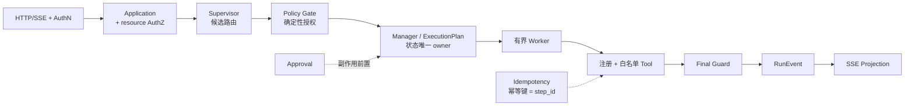

# Eino Supervisor Template

**一个用确定性代码约束模型行为的 Go + Eino Agent 脚手架。** 模型只提出候选，权限、运行状态、审批、幂等和终态全部由确定性代码裁决；同时带一套能证明自己会变红的验收门禁。

模板开箱可跑：`/api/chat` 走真实 HTTP/SSE 链路，评测命令用同一入口执行版本化 Case 并产出可复核报告，本地门禁不需要网络、凭证、Docker 或真实模型。

---

## 快速开始

前置：Go 1.25+。本地门禁不需要网络、凭证或 Docker。

### 1. 跑本地门禁（L0 + L1）

```bash
gofmt -l cmd internal eval          # 必须无输出
go vet ./cmd/... ./internal/... ./eval/...
go run ./cmd/archcheck              # 依赖方向 + 配置字段消费方检查
go test ./cmd/... ./internal/... ./eval/...
go test -race ./cmd/... ./internal/... ./eval/...
go build ./cmd/server/

# L1：用真实 HTTP/SSE 入口跑验收 Case
go build -o ./tmp/eval ./cmd/eval
./tmp/eval -dataset ./eval/datasets/synthetic-operations-v4.json \
  -report ./tmp/eval-report.json -code-version dev -config ./config.example.toml
```

期望输出 `scenario=runtime-fake cases=12 passed=12 failed=0`。退出码 `0` 全部通过 / `1` 硬断言失败 / `2` setup error（不写报告）。这里用显式包前缀而不是 `./...`，两种工作区都能直接跑；CI 在干净检出上用 `./...`，等价。

> 要区分退出码 `1` 与 `2` 必须用构建出的二进制：`go run` 会把任何非 0 退出码折叠成 `1`。

另有一条反向验证，改坏 7 处受保护行为并断言门禁必须变红（约 50 秒，会临时改源码、跑完逐字节还原）：`./eval/mutation-gate.sh`。

### 2. 启动服务

```bash
cp .env.example .env                # 本地 smoke 用；与 TOML 同目录，不提交
go run ./cmd/server/ -f ./config.example.toml
```

`/api/*` 需要 Bearer 凭证，`[auth.credentials].token_sha256_env` 指定存放 **token 的 sha256** 的环境变量。`.env.example` 里已经放好 `demo-token` 的哈希，所以上面的 `cp` 之后可以直接调用：

```bash
curl -N -X POST http://127.0.0.1:8080/api/chat \
  -H 'Authorization: Bearer demo-token' -H 'Content-Type: application/json' \
  -d '{"conversation_id":"c1","message":"查询最近30天活跃客群"}'
```

自己换 token 时用 `printf 'your-token' | sha256sum` 生成哈希。`config.example.toml` 默认使用 DeepSeek（API key 从 `[model].api_key_env` 指定的环境变量读取）；加 `-fake` 可做离线 smoke，此时不需要模型凭证，但**仍然需要认证凭证**。

路由：`/healthz`、`/api/chat`、`/api/runs/:run_id/approval`、`/api/runs/:run_id/resume`、`/api/runs/:run_id/cancel`。

### 3. 基线回归门禁

只看"本次是否全绿"会漏掉"修好一个、弄坏一个"。基线是一份已批准的逐用例判定快照，随仓库版本化；用 `-write-baseline ./eval/baselines/synthetic-operations-v4.json` 记录（拒绝从有失败的运行生成），用 `-baseline` 相对它跑门禁：

```bash
./tmp/eval -dataset ./eval/datasets/synthetic-operations-v4.json \
  -report ./tmp/eval-report.json -config ./config.example.toml \
  -baseline ./eval/baselines/synthetic-operations-v4.json
```

出现 regression / missing 退出码 `1`，基线版本与 dataset/evaluator 不一致退出码 `2`。`still_failing`（基线里本来就失败的）不算新退化，`new`（本次新增）只提示不失败。基线必须在**完整数据集**上比较，不要与 `-risk` / `-impact-tags` 的窄选集混用，否则未选中的用例会全部报成 `missing`。

### 4. 加一条验收 Case

从 [`eval/datasets/feature-acceptance-template.json`](./eval/datasets/feature-acceptance-template.json) 复制：它包含一个可被 Loader 加载、并在本地 fake 链路通过的只读 Case。替换 id、目标、请求文本、期望结果和 `forbidden_side_effects` 即可；需要验收"JSON 输出 + 最终状态 + 运行证据"时，可追加数据库与日志后置断言（只保留行数、字段摘要哈希和脱敏 phase）。新增的 claim 要同步登记进 `eval/coverage.json`，否则覆盖率校验会失败。

### 5. 加一个能力

换成自己的业务时，改动范围是这五处：`examplebusiness/registry.go` 声明 Tool（ID、contract、实现）与 Worker、Route（允许的 Tool、匹配词）；`examplebusiness/toolhandlers.go` 注册该 Tool 的 handler；`config.example.toml` 在 `[agent.workers.*]`、`[agent.routes.*]`、`[tools.*]` 里登记（未登记的引用会让启动失败）；`prompts/` 放该 Worker 的模型指令（用 `eino_adk` runner 时必需）；`eval/datasets/` 与 `eval/coverage.json` 补验收 Case 与 claim。

`internal/composition/` 不需要为单个 Tool 或 Worker 改动——它只调用整包入口（`Workers()`、`Routes()`、`ToolContracts()`、`RegisterToolHandlers()`）。替换整个示例业务时，替换 [`examplebusiness`](./internal/infrastructure/examplebusiness) 包并改这些调用点即可。该包的 handler 只依赖"注册表/执行器"这类能力接口，不 import Tool 实现包。

---

## 这个模板解决什么问题

大模型输出即使 JSON 结构完全正确，也可能做出这些事：越权调用未授权 Tool、绕过审批直接产生副作用、恢复时重复执行已完成的写入、发出两个终态事件、或者把不合格的内容当成最终答复。

**本模板要回答的问题是：当模型不可信时，一个 Agent 服务应该长什么样。** 做法是把 LLM 的权限降到最低——它只能提出结构化的候选路由、参数和文本，其余交给确定性代码。它是一套可验证的工程脚手架，不是生产平台：每个安全边界都有合同测试或可重放的验收 Case，并且有一条反向验证脚本，证明这些门禁在被改坏时确实会变红。

| | |
| --- | --- |
| **适合** | 有副作用的运营 / 客服 / 数据类 Agent（发消息、下单、写库需要审批、幂等与审计留痕）；需要人工审批介入的长流程；把"模型不可信"当设计前提的系统；需要可复核质量门禁的团队 |
| **不适合** | 开放式自主循环、多 Agent 协作、DAG 工作流编排；画布、插件市场、多租户 SaaS；数据库级或跨进程 exactly-once、多主高可用；用 LLM judge 或模型自评分作为合并门禁 |

---

## 运行链路与硬边界

所有请求必须走这一条链路，业务代码不得绕行：



各环节的职责是硬边界：

- `HTTP/SSE + AuthN` 只解析请求、验证 Bearer 凭证并建立流；`Application + resource AuthZ` 做用例编排，run 绑定创建主体，重放、审批、恢复、取消都先校验归属。
- `Supervisor` 只提出候选，不能授权能力、修改状态、生成幂等键或决定终态；`Policy Gate` 依据注册表、风险、权限和输入合同确定性地允许或拒绝。
- `Manager`（落在 `internal/application/run.Service`）是运行状态与 `ExecutionPlan` 的唯一 owner；`Worker` 只完成一个已声明、有限时长和有限步骤的任务，没有最终答复权。
- `Tool` 只能在 Worker 允许集合内调用，且必须注册、校验输入、设置超时、分类错误；`Final Guard` 校验结构、敏感信息与终态，不合格只能转为分类失败；`SSE Projection` 只投影内部事件，不重新判断权限或业务状态。

这里的 supervisor 是**应用层的确定性 supervisor**：`internal/infrastructure/llm/` 把模型输出变成结构化候选（`SupervisorDecision`），授权、计划与终态由 `internal/domain/agent/` 和 `internal/application/run/` 决定。Eino 侧用的是官方推荐的 `adk.ChatModelAgent` + `adk.Runner` + `compose.CheckPointStore`；`adk/prebuilt/supervisor` 未使用（Eino 官方在源码里标注它 NOT RECOMMENDED，建议改用 ChatModelAgent + AgentTool 或 DeepAgent）。

三条全局约束，说一次：**依赖方向固定**（`interfaces → application → domain`，`infrastructure` 通过合同接入，`composition` 只做装配），由 `cmd/archcheck` 强制；**能力只能显式注册**（Worker、Route、Prompt、Runner、Tool、模型 provider 都在启动期冻结，配置只能引用已注册 ID，重复 ID、缺失引用、allow-list 越权、降低审批要求、未注册 provider 都让启动直接失败，禁止反射扫描与 `init()` 自注册）；**每个状态只有一个 owner**（会话归 `conversation`，执行计划与运行状态归 `agent`，审批归 `approval`；checkpoint 只是恢复机制，不是新的状态所有者）。

**有界执行与可恢复**：每次执行有最大步骤数、调用次数、重试预算、超时和 deadline；取消是协作式语义，不承诺强制终止任意外部进程；恢复走 checkpoint，外部调用已发出但结果未提交时返回 `RUN_OUTCOME_UNKNOWN` 并**禁止自动重试**，等待人工对账；每个 run 只有一个公开终态事件。

---

## AI 编码底座

这一节是本模板区别于普通 demo 的部分：**AI 生成的代码由确定性检查兜底，而不是靠人肉 review 记住所有边界。**

### 架构防腐

分层架构烂掉通常不是因为没人写文档，而是因为**没有任何检查会因为它被破坏而变红**。`cmd/archcheck` 在 CI 里跑三条互相不能替代的规则，任一条被违反即失败：

- **依赖方向**：`domain` 不得依赖 application/interfaces/infrastructure；`application` 不得依赖 interfaces/infrastructure；`interfaces` 不得依赖 infrastructure（observability 合同作为传输侧 concern 例外）；`infrastructure` 不得依赖 `internal/config`；`cmd/*` 不得依赖 application。
- **领域包只许标准库与 `internal/domain/**`**：上面那条只比较**模块内**路径前缀，对模块外 import 一律放行——领域包引入 Eino、GORM 这类第三方会**静默通过**，这条规则单独堵它。
- **每个 TOML 配置字段必须有消费方**："声明了却没接线"的配置项，恰恰是最容易让人误以为某项能力已经生效的地方。

### 评测

Case 走的是与线上完全一致的 `/api/chat`、approval、resume、cancel 路由，判定只读结构化证据，报告显式写明它到底跑了哪个执行器。**L0**（格式、静态检查、依赖方向、单元与合同测试含 race）与 **L1**（真实 HTTP/SSE 链路上的确定性验收 Case、覆盖率校验、基线回归）可阻断合并；**L2**（可选 LLM judge 与在线模型评测）不可阻断，目前只有 `eval/feedback.go` 的咨询性合同、**没有可执行入口**。

四个确定性 Evaluator 各自硬断言一个维度：`business_correctness`（终态、事件类型序列、Case 声明的结构化结果字段）、`architecture_boundary`（每次 Tool 调用都能对上启动期注册与 Policy 证据）、`side_effect_safety`（副作用的前置审批与幂等、写入计数、cleanup）、`stability`（事件序号单调、trace 关联、耗时与重试预算、重复判定稳定）。

证据合同本身也在判定范围内：case/run 标识必须与本次 Case 一致，EventID 必须唯一且归属同一个 run，序号必须单调，终态事件只能有一个；缺少必需的治理证据、出现匿名 side-effect 调用或审批被借用到别的动作上，都是**硬失败**。声明了却采集不到的证据不会因为"某个 evaluator 恰好没看到对应事件"就被动通过。

报告（JSON 与 JSONL，权限 `0600`）逐 Case 记录 `run_id`、HTTP 状态、事件顺序、trace ID、终态、耗时、重试、fake write count、cleanup 结果、四个 Evaluator 的独立结论，以及失败时的 `failed_assertion`、failure taxonomy、evidence reference 和可空 `human_disposition`；不写凭证、完整 Prompt、SQL 参数或未脱敏 Tool payload。报告还带显式 `evaluation_profile`：当前只有 `runtime-fake` 有可执行入口，`cmd/eval` 即使环境变量选了真实模型也会强制 fake，所以它的结论不能描述 DeepSeek 等真实模型的能力。

### 门禁自证

一个不会变红的门禁等于没有门禁。`eval/mutation-gate.sh` 对 7 处受保护行为注入**真实故障**——直接改源码 → 跑门禁 → 断言必须变红 → 立即从备份逐字节还原。这 7 处是：Worker/Tool 白名单、副作用前置审批、敏感输出拦截、终态唯一性、取消信号、幂等键去重、审批绑定到即将执行的那个动作。

**有一条没被抓到，或者有注入因锚点失配而没能施加，脚本都会指名该行并以非 0 退出**：前者是退出码 `1`，说明这条保护缺少覆盖，是下一步要补的测试或验收 Case；后者是退出码 `2`，说明注入表已经和源码脱节，这一行从未被验证过。两者同时出现报 `2`。哪一种都不是可以忽略的噪音。

输出是一张 `mutation × L0 × L1` 矩阵，两列都要读：`L1` 是验收数据集，`L0` 是 Go 合同测试。白名单与幂等去重两行只有 `L0` 变红，它们在 `L1` **结构性不可达**（豁免与代码证据写在 `eval/coverage.json`），其余五行两层都能抓住。

### 闭环：需求 → 用例 → 报告 → 待办 → 补用例

```bash
# 每条 claim 要么指向 Case，要么显式豁免并写明理由
go run ./cmd/eval -dataset ./eval/datasets/synthetic-operations-v4.json \
  -check-coverage ./eval/coverage.json -config ./config.example.toml
```

每一环都会失败：`eval/coverage.json` 是人工评审过的 claim → Case 对照表，指向不存在的用例、既豁免又映射、或既不映射也不豁免，都以退出码 `2` 失败，**没有用例支撑的 claim 藏不住**；失败时加 `-triage ./tmp/eval-triage.json` 产出人读与机器读两种待办；修完必须补一个能抓住该回归的 Case，并用 `./eval/mutation-gate.sh` 证明它确实会红。基线快照记录的不只是通过与否，还有每个 Case 的 `verdict_digest`（不含按请求生成的 trace id，同一份代码独立跑两次得到相同摘要），重新批准时比对的是整份"测量身份"，标注相同而证据变了会被暴露出来。

---

## 配置

启动时配置按以下顺序生效：`config.example.toml`（或 `-f` 指定的 TOML）→ TOML 同目录 `.env` / 已声明环境变量覆盖 → `cmd/server -fake` 最后强制 `provider=fake`、`model=fake-model`。**`config.example.toml` 是环境变量与字段的唯一清单**（`cmd/archcheck` 保证每个字段都有真实消费方），常用覆盖是 `MODEL_PROVIDER`、`LLM_MODEL`、`LLM_BASE_URL`、`FAKE_MODEL`、`LISTEN_ADDR`、`PERSISTENCE_BACKEND`、`MYSQL_ENABLED`、`READ_ONLY_TOOL_ENDPOINT` 与 `OTEL_*` / `LANGFUSE_*` 系列。

模型 provider 是一张显式注册表（`internal/infrastructure/llm/provider.go`）：**新增一个模型 = 加一个 `newXxxProvider` 并登记一行**，装配层不认识任何具体 provider；`provider` 填了未注册的值，启动直接报错并列出已注册项，不会静默回退。

配置只能选择**启动时已注册**且获准的实现，不能新增 Worker/Tool、扩大权限、降低审批要求或绕过 Policy Gate。密钥只从服务端配置或凭证系统解析，禁止进入 Prompt、事件正文和普通日志。**每个旋钮都有默认值**：运行参数（超时、预算、心跳、请求体上限、保留期、文件权限、重试上限）在 `Config.applyDefaults()` 里有安全默认值，但默认值不扩大权限边界——模型 provider、认证凭证、Worker/Tool 注册与风险声明仍必须显式配置，缺省即启动失败。提示词等资源路径按配置文件所在目录解析，不依赖启动时的工作目录。少数配置在有实现之前被刻意删除而不是保留为占位（例如 `[approval].idempotency_window`），因为只声明不实现会让人误以为该能力已经生效。

---

## 技术栈与当前状态

Go 1.25；Eino v0.9.12（`adk.ChatModelAgent` / `adk.Runner` / `compose.CheckPointStore`，未用 `adk/prebuilt/*`）；模型为 DeepSeek（`eino-ext`）或本地 fake，经 provider 注册表选择；HTTP 用 Gin v1.12 做 SSE 单向投影；存储为内存 / 文件，可选 MySQL + GORM v1.31；观测为 OpenTelemetry v1.43，可选 Langfuse；评测是自建 CLI（`eval/` 包只依赖标准库，无第三方评测框架）+ 版本化 JSON 资产。依赖集合以 `go.mod` 为准。

状态词的判据：`implemented` 有代码和本地验证证据；`partial` 只有部分闭环或生产语义未证实；`deferred` 明确暂缓。

| 能力 | 状态 | 说明 |
| --- | --- | --- |
| 固定运行链路、Policy Gate、审批、幂等、取消、恢复 | `implemented` | 有合同测试与可重放验收 Case |
| 版本化 Dataset、HTTP/SSE Runner、JSON/JSONL 报告 | `implemented` | 本地命令可实际跑通，默认不依赖外部服务 |
| 四个确定性 Evaluator、基线门禁、覆盖率与归因、改坏验证 | `implemented` | 均为本地离线门禁 |
| 失败 taxonomy、人工 disposition、Judge 合同 | `partial` | 合同与脱敏摘要已有；Judge 仍不进入门禁 |
| OpenTelemetry / Langfuse 观测出口 | `partial` | 后端故障只记诊断；score 上传已实现（`cmd/eval -langfuse-upload`，读 `LANGFUSE_API_URL`/`LANGFUSE_PUBLIC_KEY`/`LANGFUSE_SECRET_KEY`，缺凭证只 warning、不改判定），托管 Dataset/Experiment 同步 deferred |
| MySQL / GORM | `partial` | 有 adapter 与本地 smoke；不是默认依赖，不代表生产 HA |
| 真实模型驱动的多步 ReAct / Graph Runner | `deferred` | 真实模型只用于生成候选路由，Worker 执行是最小单 Tool 适配器 |
| 在线 LLM Judge、`coding-*` 场景、真实 CRM / 营销触达 | `deferred` | 不进入默认硬门禁；外部业务只有合成 fixture 和 fake Tool |
| 并行 / DAG / 开放式自主循环 | `deferred` | 执行计划是有序序列，`limits.max_plan_steps` 默认 8；两种 provider 都只提得出 ≤2 步 |
| 跨进程 exactly-once、多租户平台 | `deferred` | 文件快照不提供分布式 exactly-once |

`implemented` 只表示当前代码和本地验证达到该范围；不要把配置字段存在或 exporter 初始化当作实现证据。

---

## 从哪里读细节

本仓库只发布这一份 README，架构、评测方法和技术选型都不另外存文档。需要细节时按下面的顺序读源码——**代码和 CI 就是唯一事实来源**：`internal/domain/`（合同与不变量）→ `internal/application/`（运行状态与 `ExecutionPlan` 的唯一 owner）→ `internal/interfaces/http/`（HTTP/SSE 投影）；评测与门禁看 `eval/`（Dataset、Evaluator、Runner、`mutation-gate.sh`）和 `.github/workflows/ci.yml`；可配置项看 `config.example.toml`；替换示例业务看 `internal/infrastructure/examplebusiness/` 与 `internal/infrastructure/llm/provider.go`。

---

## 许可证

本项目原创代码和文档采用 [MIT License](./LICENSE)。第三方依赖按各自许可证使用。
