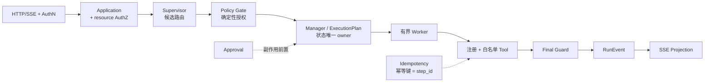

# Eino Supervisor Template

**一个用确定性代码约束模型行为的 Go + Eino Agent 参考模板。** 模型只提出候选，权限、运行状态、审批、幂等和终态全部由确定性代码裁决，并配一套能证明自己会变红的验收门禁。

模板开箱可跑：`/api/chat` 走真实 HTTP/SSE 链路，评测命令用同一入口执行版本化 Case 并产出可复核报告，本地门禁不需要网络、凭证、Docker 或真实模型。

```bash
# 两分钟自己验证：先跑通，再看它会不会红
go test ./cmd/... ./internal/... ./eval/...        # L0：合同与单元测试
go run ./cmd/eval -dataset ./eval/datasets/synthetic-operations-v4.json \
  -report ./tmp/eval-report.json -config ./config.example.toml   # L1：12 条验收 Case
./eval/mutation-gate.sh                            # 门禁自证：改坏 7 处，必须全部被抓
```

不想先读完全文的话，跳到 [门禁自证](#门禁自证)：那里不是介绍门禁，而是改坏源码证明门禁真的会变红。

---

## 目录

- [这个模板解决什么问题](#这个模板解决什么问题)
- [运行链路与确定性闸门](#运行链路与确定性闸门)
- [架构防腐](#架构防腐)
- [门禁自证](#门禁自证)
- [边界与当前状态](#边界与当前状态)
- [快速开始](#快速开始)
- [评测体系](#评测体系)
- [配置](#配置)
- [技术栈](#技术栈)
- [从哪里读细节](#从哪里读细节)
- [许可证](#许可证)

---

## 这个模板解决什么问题

大模型输出即使 JSON 结构完全正确，也可能做出这些事：越权调用未授权 Tool、绕过审批直接产生副作用、在恢复时重复执行已完成的写入、发出两个终态事件、或者把不合格的内容当成最终答复。

**本模板要回答的问题是：当模型不可信时，一个 Agent 服务应该长什么样。**

做法是把 LLM 的权限降到最低——它只能提出结构化的候选路由、参数和文本，其余交给确定性代码：

```text
模型：提出候选 → Policy Gate：决定是否允许 → Manager：推进已批准的计划
     → Worker：完成单一有界任务 → Tool：执行已声明能力 → Final Guard：校验终态与公开文本
```

它同时是一套**可验证的工程样例**，而不是生产平台：每个安全边界都有合同测试或可重放的验收 Case，并且有一条反向验证脚本，用来证明这些门禁在被改坏时确实会变红。

---

## 运行链路与确定性闸门

所有请求必须走这一条链路，业务代码不得绕行：



各环节的职责是硬边界：

- `HTTP/SSE + AuthN` 只解析请求、验证 Bearer 凭证并建立流；`/api/*` 必须携带可信主体。
- `Application + resource AuthZ` 做用例编排；run 绑定创建主体，重放、审批、恢复、取消都先校验归属。
- `Supervisor` 只提出候选，不能授权能力、修改状态、生成幂等键或决定终态。
- `Policy Gate` 依据注册表、风险、权限和输入合同确定性地允许或拒绝。
- `Manager`（落在 `internal/application/run.Service`）是运行状态与 `ExecutionPlan` 的唯一 owner。
- `Worker` 只完成一个已声明、有限时长和有限步骤的任务，没有最终答复权。
- `Tool` 只能在 Worker 允许集合内调用，且必须注册、校验输入、设置超时、分类错误。
- `Final Guard` 校验结构、敏感信息与终态；不合格只能转为分类失败，不能猜测替代结果。
- `SSE Projection` 只投影内部事件，不重新判断权限或业务状态。

**依赖方向固定**，由 `cmd/archcheck` 在门禁中强制：

```text
interfaces → application → domain
composition → application + domain + infrastructure
infrastructure → domain/application 合同
```

领域层不依赖 HTTP、Eino、数据库、MCP、具体模型或 SSE；基础设施实现只能通过领域或应用合同接入；`composition` 只做注册与装配，不承载业务判断。能力只在启动期显式注册，配置只能引用已注册 ID；重复 ID、缺失引用、allow-list 越权和降低审批要求的配置会在启动时直接失败。禁止反射扫描、`init()` 自注册和热加载。

**确定性代码拥有权威**：权限、审批、幂等键、重试和终态由代码决定，不由模型输出推断；写入、发送、删除等副作用必须经过 `Policy Gate → Approval → Idempotency → Tool → Audit Event`；只读 Tool 同样要注册、白名单、校验输入、设置超时并分类错误；模型输出必须经过结构化解析、Schema 校验和注册表检查才能进入执行。

**每个状态只有一个 owner**：会话状态归 `conversation`，执行计划与运行状态归 `agent`，审批状态归 `approval`。不存在通用 `state` 容器；checkpoint 只是恢复机制，不是新的业务状态所有者。`SupervisorDecision`、`ApprovedRoute`、`ExecutionPlan`、`WorkerContract`、`tool.Contract`、`RunEvent`、`Checkpoint`、`approval.Request` 的语义保持稳定。

**有界执行与可恢复**：每次执行有最大步骤数、调用次数、重试预算、超时和 deadline；取消是协作式语义（per-run context），不承诺强制终止任意外部进程；恢复走 checkpoint，外部调用已发出但结果未提交时返回 `RUN_OUTCOME_UNKNOWN` 并**禁止自动重试**，等待人工对账；每个 run 只有一个公开终态事件。

---

## 架构防腐

分层架构烂掉从来不是因为没人写文档，而是因为**没有任何检查会因为它被破坏而变红**。这套模板在三个位置设卡，每一条都能被门禁抓住。

### 静态结构：`cmd/archcheck` 在 CI 里跑

三条互相不能替代的规则，任一条被违反即失败：

| 规则 | 挡住的退化 |
| --- | --- |
| **依赖方向** | `domain` 不得依赖 application/interfaces/infrastructure；`application` 不得依赖 interfaces/infrastructure；`interfaces` 不得依赖 infrastructure（observability 合同作为传输侧 concern 例外）；`infrastructure` 不得依赖 `internal/config`；`cmd/*` 不得依赖 application |
| **领域包只许标准库与 `internal/domain/**`** | 上面那条只比较**模块内**路径前缀，对模块外 import 一律放行——领域包引入 Eino、GORM 这类第三方会**静默通过**。这条规则单独堵它 |
| **每个 TOML 配置字段必须有消费方** | "声明了却没接线"的配置项，恰恰是最容易让人误以为某项能力已经生效的地方 |

### 启动期：能力只能被显式注册

`RuntimeCatalog` 在启动时冻结 Worker、Route、Prompt、Runner、Tool 和预算引用，配置只能选择**已注册**的实现：不能创造能力、扩大权限或降低审批等级。重复 ID、缺失引用、allow-list 越权和降低审批要求的配置会在启动时直接失败。禁止反射扫描、`init()` 自注册和热加载——能力不会因为某个包恰好被 import 就出现。

### 所有权与失败半径

- `Manager` 是运行状态与 `ExecutionPlan` 的唯一 owner，Worker 没有最终答复权；trace、日志和 SQL 只提供证据，不能成为业务状态 owner。
- 领域合同不导入 HTTP、Eino、数据库、MCP、具体模型或 SSE。替换 Gin、Eino、存储或模型时，改的是装配，不是领域合同及其含义。
- 每个 run 有步骤、调用、重试、成本、deadline 和取消边界；Runner 调用期间不持有全局状态锁。
- **未知结果不自动重试**：外部调用已开始但结果未确认时进入 `waiting_reconciliation` 等人工对账。`OutcomeUnknownError` 与可重试的 `PreCallError` 是分开的类型，只有"调用尚未开始"的失败才消耗重试预算——这类只在"已发出、未确认"窗口里出现的 bug，普通成功/失败用例抓不到。
- 观测、日志或 snapshot 失败只产生 degraded 信号，既不改变业务状态，也不改变验收判定。

---

## 门禁自证

一个不会变红的门禁等于没有门禁。`eval/mutation-gate.sh` 对 7 处受保护行为注入**真实故障**——直接改源码 → 跑门禁 → 断言必须变红 → 立即从备份逐字节还原：

| 注入 | 被破坏的保护 |
| --- | --- |
| `policy-allowlist` | Worker/Tool 白名单（Tool 越权） |
| `approval-bypass` | 副作用必须经过审批 |
| `final-guard-off` | 敏感输出（凭证/Prompt/内部路径）拦截 |
| `terminal-uniqueness-off` | 每个 run 只能有一个终态事件 |
| `cancel-signal-lost` | 取消信号生效 |
| `idempotency-dedupe-off` | 相同幂等键只写一次 |
| `approval-plan-level-binding` | 审批绑定到即将执行的那一个动作 |

**有一条没被抓到，或者有注入因锚点失配而没能施加，脚本都会指名该行并以非 0 退出**：前者是退出码 `1`，说明这条保护缺少覆盖，是下一步要补的测试或验收 Case；后者是退出码 `2`，说明注入表已经和源码脱节，这一行从未被验证过。两者同时出现报 `2`——此时结论整体不可信。哪一种都不是可以忽略的噪音。

输出是一张 `mutation × L0 × L1` 矩阵，两列都要读：`L1` 是验收数据集，`L0` 是 Go 合同测试。`policy-allowlist` 与 `idempotency-dedupe-off` 只有 `L0` 变红，它们在 `L1` **结构性不可达**（豁免与代码证据写在 `eval/coverage.json`），其余五行两层都能抓住。

两条使用纪律：锚点失配不算"通过"——脚本以退出码 `2` 停下，要求先把注入表更新到当前源码，再谈结论；门禁抓不住的那条保护就是下一步要补的用例。

---

## 边界与当前状态

**适合**

- 有副作用的运营 / 客服 / 数据类 Agent：发消息、下单、写库等动作需要审批、幂等与审计留痕。
- 需要人工审批介入的长流程：审批等待、跨请求续跑、进程重启后恢复。
- 把"模型不可信"当设计前提的系统：结构化输出 + 注册表校验 + Policy Gate + Final Guard。
- 需要可复核质量门禁的团队：本地确定性评测，默认离线，不依赖在线模型或外部平台。
- 希望执行器可替换的项目：换 Eino、换模型、换 Worker 实现时，HTTP、状态机、通用运行循环和 SSE 投影不变。

**不适合**

- 开放式自主循环、多 Agent 协作、DAG 工作流编排。
- 画布、插件市场、多租户 SaaS 平台。
- 数据库级或跨进程 exactly-once、多主高可用。
- 用 LLM judge 或模型自评分作为合并门禁。

**当前状态**（三个状态词的判据：`implemented` 有代码和本地验证证据；`partial` 只有部分闭环或生产语义未证实；`deferred` 明确暂缓）

| 能力 | 状态 | 说明 |
| --- | --- | --- |
| 固定运行链路、Policy Gate、审批、幂等、取消、恢复 | `implemented` | 有合同测试与可重放验收 Case |
| 版本化 Dataset、HTTP/SSE Runner、JSON/JSONL 报告 | `implemented` | 本地命令可实际跑通，默认不依赖外部服务 |
| 四个确定性 Evaluator、基线门禁、覆盖率与归因、改坏验证 | `implemented` | 均为本地离线门禁 |
| 失败 taxonomy、人工 disposition、Judge 合同 | `partial` | 合同与脱敏摘要已有；Judge 仍不进入门禁 |
| OpenTelemetry / Langfuse 观测出口 | `partial` | 有低基数关联与运行证据；后端故障只记诊断，不影响判定；score 上传已实现（`cmd/eval -langfuse-upload`，读 `LANGFUSE_API_URL`/`LANGFUSE_PUBLIC_KEY`/`LANGFUSE_SECRET_KEY`，缺凭证只 warning、不改判定），Langfuse 托管 Dataset/Experiment 同步 deferred |
| MySQL / GORM | `partial` | 有 adapter 与本地 smoke；不是默认依赖，不代表生产 HA |
| 真实模型驱动的 Eino 多步 ReAct / Graph Runner | `deferred` | 当前默认 Runner 是最小单 Tool 适配器 |
| 在线 LLM Judge、`coding-*` 场景 | `deferred` | 不进入默认硬门禁 |
| 真实 CRM / 营销触达 | `deferred` | 只有合成 fixture 和 fake Tool |
| 并行 / DAG / 开放式自主循环 | `deferred` | 执行计划是有序序列，`limits.max_plan_steps` 默认 8；当前两种 provider 都只提得出 ≤2 步 |
| 跨进程 exactly-once、多租户平台 | `deferred` | 文件快照不提供分布式 exactly-once |

`implemented` 只表示当前代码和本地验证达到该范围；不要把配置字段存在或 exporter 初始化当作实现证据。

---

## 快速开始

前置：Go 1.25+。默认路径不需要网络、凭证或 Docker。

### 1. 跑本地门禁（L0 + L1）

`L0` 是格式、静态检查、依赖方向与单元/合同测试；`L1` 是真实 HTTP/SSE 链路上的确定性验收 Case。只有这两层有权阻断合并。

```bash
gofmt -l cmd internal eval          # 必须无输出
go vet ./cmd/... ./internal/... ./eval/...
go run ./cmd/archcheck              # 依赖方向 + 配置字段消费方检查
go test ./cmd/... ./internal/... ./eval/...
go test -race ./cmd/... ./internal/... ./eval/...
go build ./cmd/server/

# L1：用真实 HTTP/SSE 入口跑验收 Case
go build -o ./tmp/eval ./cmd/eval
./tmp/eval \
  -dataset ./eval/datasets/synthetic-operations-v4.json \
  -report ./tmp/eval-report.json \
  -code-version dev \
  -config ./config.example.toml
```

期望输出：`scenario=runtime-fake cases=12 passed=12 failed=0`。退出码 `0` 全部通过 / `1` 硬断言失败 / `2` setup error（不写报告）。这里用显式包前缀而不是 `./...`，两种工作区都能直接跑；CI 在干净检出上用 `./...`，等价。

> 需要区分退出码 `1` 与 `2` 时必须用构建出的二进制：`go run` 会把任何非 0 退出码折叠成 `1`。

### 2. 启动服务

```bash
go run ./cmd/server/ -f ./config.example.toml
```

`config.example.toml` 默认使用 DeepSeek（API key 从环境变量读取）；加 `-fake` 可在无外部模型的条件下做离线 smoke。路由：`/healthz`、`/api/chat`、`/api/runs/:run_id/approval`、`/api/runs/:run_id/resume`、`/api/runs/:run_id/cancel`。

### 3. 基线回归门禁

只看"本次是否全绿"会漏掉"修好一个、弄坏一个"。基线是一份已批准的逐用例判定快照，随仓库版本化：

```bash
# 记录/更新基线（拒绝从有失败的运行生成）
./tmp/eval -dataset ./eval/datasets/synthetic-operations-v4.json \
  -report ./tmp/eval-report.json -config ./config.example.toml \
  -write-baseline ./eval/baselines/synthetic-operations-v4.json

# 相对基线跑门禁：出现 regression / missing 退出码 1，版本不一致退出码 2
./tmp/eval -dataset ./eval/datasets/synthetic-operations-v4.json \
  -report ./tmp/eval-report.json -config ./config.example.toml \
  -baseline ./eval/baselines/synthetic-operations-v4.json
```

`still_failing`（基线里本来就失败的用例）不算新退化；`new`（本次新增）只提示不失败。基线必须在**完整数据集**上比较，不要与 `-risk` / `-impact-tags` 的窄选集混用，否则未被选中的用例会全部报成 `missing`。

---

## 评测体系

评测的价值不在于"跑过一遍"，而在于**跑出来的结论不能被绕过、也不能被误读**：Case 走的是与线上完全一致的 `/api/chat`、approval、resume、cancel 路由，判定只读结构化证据，报告显式写明它到底跑了哪个执行器。

### 四个确定性 Evaluator

| Evaluator | 硬断言什么 |
| --- | --- |
| `business_correctness` | 终态、事件类型序列、Case 声明的结构化结果字段 |
| `architecture_boundary` | 每次 Tool 调用都能对上启动期注册与 Policy 证据 |
| `side_effect_safety` | 副作用的前置审批与幂等、写入计数、cleanup |
| `stability` | 事件序号单调、trace 关联、耗时与重试预算、重复判定稳定 |

证据合同本身也在判定范围内：case/run 标识必须与本次 Case 一致，EventID 必须唯一且归属同一个 run，序号必须单调，终态事件只能有一个；缺少必需的治理证据、出现匿名 side-effect 调用或审批被借用到别的动作上，都是**硬失败**。声明了却采集不到的证据不会因为"某个 evaluator 恰好没看到对应事件"就被动通过——这些反绕过规则由 `eval/evaluator/evaluator_test.go` 覆盖。

### 分层门禁

| 层 | 内容 | 是否可阻断 |
| --- | --- | --- |
| **L0** | 格式、静态检查、依赖方向、单元与合同测试（含 race） | 是 |
| **L1** | 真实 HTTP/SSE 链路上的确定性验收 Case、覆盖率校验、基线回归 | 是 |
| **L2** | 可选 LLM judge 与在线模型评测 | 否。目前只有 `eval/feedback.go` 的咨询性合同，**没有可执行入口** |

只有确定性层有权阻断合并。上表的命令可以原样搬进任意 CI；托管平台的 Required Checks 需要单独配置，不能只凭存在一个 workflow 文件就宣称合并门禁已生效。

### 闭环：需求 → 用例 → 报告 → 待办 → 补用例

```bash
# 每条 claim 要么指向 Case，要么显式豁免并写明理由
go run ./cmd/eval -dataset ./eval/datasets/synthetic-operations-v4.json \
  -check-coverage ./eval/coverage.json -config ./config.example.toml

# 失败时额外产出可执行待办（人读 + 机器读）
go run ./cmd/eval -dataset ./eval/datasets/synthetic-operations-v4.json \
  -report ./tmp/eval-report.json -triage ./tmp/eval-triage.json \
  -config ./config.example.toml
```

修完必须补一个能抓住该回归的 Case，并用 `./eval/mutation-gate.sh` 证明它确实会红。

闭环的关键在于每一环都会失败：`eval/coverage.json` 是人工评审过的 claim → Case 对照表，指向不存在的用例、既豁免又映射、或既不映射也不豁免，都以退出码 `2` 失败——**没有用例支撑的 claim 藏不住**；失败时 `-triage` 额外产出人读与机器读两种待办；补完 Case 还要用改坏验证证明它会红。

基线快照记录的不只是通过与否，还有每个 Case 的 `verdict_digest`（覆盖观察到的事件、终态和结果投影，且**不含按请求生成的 trace id**，所以同一份代码独立跑两次得到相同摘要）。门禁只看 `passed`，但重新批准时比对的是整份"测量身份"——**标注相同而证据变了会被暴露出来**，正常重跑则不产生 diff。

### 报告与场景标签

报告（JSON 与 JSONL，权限 `0600`）带 `report_schema_version`、Dataset/Case 版本、`code_version`、逐 Case 的 `run_id`、HTTP 状态、事件顺序、trace ID、终态、耗时、重试、fake write count、cleanup 结果与 `cleanup_warning`（观测后端在关闭期的导出失败记在这里，不参与判定）、四个 Evaluator 的独立结论，以及失败时的 `failed_assertion`、failure taxonomy、evidence reference 和可空 `human_disposition`。不写凭证、完整 Prompt、SQL 参数或未脱敏 Tool payload。

报告还带显式 `evaluation_profile`，区分 `runtime-fake`、`runtime-real`、`coding-fake`、`coding-real`。当前只有 `runtime-fake` 有可执行入口：`cmd/eval` 即使环境变量选了真实模型也会强制 fake，因此它的结论只代表本地合同路径，不能描述 DeepSeek 等真实模型的能力；其余场景是合同边界，标为 deferred。

### 新增一条 Case

从 [`eval/datasets/feature-acceptance-template.json`](./eval/datasets/feature-acceptance-template.json) 复制：它包含一个可被 Loader 加载、并在本地 fake 链路通过的只读 Case。替换 id、目标、请求文本、期望结果和 `forbidden_side_effects` 即可；需要验收"JSON 输出 + 最终状态 + 运行证据"时，可追加数据库与日志后置断言（只保留行数、字段摘要哈希和脱敏 phase）。

---

## 配置

启动时配置按以下顺序生效：

```text
config.example.toml（或 -f 指定的 TOML）
  → TOML 同目录 .env / 已声明环境变量覆盖
  → cmd/server -fake 最后强制 provider=fake、model=fake-model
```

| 环境变量 | 覆盖字段或作用 |
| --- | --- |
| `MODEL_PROVIDER` | `[model].provider`（`deepseek` / `fake`） |
| `LLM_MODEL` / `LLM_BASE_URL` | `[model].name` / `[model].base_url` |
| `FAKE_MODEL` | 为 `true` 时把 provider/name 切到 `fake` / `fake-model` |
| `LISTEN_ADDR` / `LOG_LEVEL` | `[server].listen_addr` / `[observability].log_level` |
| `PERSISTENCE_BACKEND` / `PERSISTENCE_DIR` | `[storage].backend` / `[storage].dir` |
| `MYSQL_ENABLED` / `MYSQL_DSN_ENV` | `[mysql].enabled` / `[mysql].dsn_env` |
| `READ_ONLY_TOOL_ENDPOINT` | `[tools.user_query].endpoint`（只读 Tool 的目标地址） |
| `OTEL_ENABLED` / `OTEL_EXPORTER_OTLP_ENDPOINT` / `OTEL_EXPORTER_OTLP_INSECURE` / `OTEL_SERVICE_NAME` | OTLP 导出开关、endpoint、insecure、service name |
| `LANGFUSE_ENABLED` / `LANGFUSE_ENDPOINT` / `LANGFUSE_HEADERS_ENV` | Langfuse 观测接入 |

配置只能选择**启动时已注册**且获准的实现，不能新增 Worker/Tool、扩大权限、降低审批要求或绕过 Policy Gate。密钥只从服务端配置或凭证系统解析，禁止进入 Prompt、事件正文和普通日志。

### 默认值与"配置优先于代码"

原则是**配置优先于代码，不保留硬编码，但每个旋钮都要有默认值**：

- 所有运行参数（超时、预算、心跳、请求体上限、保留期、文件权限、重试上限）都在 `Config.applyDefaults()` 里有安全默认值，省略即用默认，代码里不再有等效硬编码。
- 默认值只覆盖运行参数，**不会扩大权限边界**：模型 provider、认证凭证、Worker/Tool 注册与风险声明仍必须显式配置，缺省时启动直接失败。
- 提示词等资源路径**按配置文件所在目录解析**，不依赖启动时的工作目录。
- `cmd/archcheck` 会校验「每个 TOML 配置字段都必须有消费方」——声明了却没有实现方的配置项会让门禁变红，避免配置与实现脱节。

少数配置在有实现之前被刻意删除而不是保留为占位（例如 `[approval].idempotency_window`），因为只声明不实现会让人误以为该能力已经生效。

---

## 技术栈

| 组件 | 版本 / 说明 |
| --- | --- |
| Go | 1.25 |
| Eino | `github.com/cloudwego/eino` v0.9.12（ADK Supervisor 适配：`eino/adk`、`adk/prebuilt/supervisor`） |
| 模型 | DeepSeek（`eino-ext` model 组件）/ 本地 fake |
| HTTP | Gin v1.12，SSE 单向投影 |
| 存储 | 内存 / 文件；可选 MySQL + GORM v1.31 |
| 观测 | OpenTelemetry v1.43（OTLP trace/metric），可选 Langfuse |
| 评测 | 自建 CLI（`eval/` 包本身只依赖标准库，无第三方评测框架）+ 版本化 JSON 资产 |

---

## 从哪里读细节

本仓库只发布这一份 README。架构、评测方法和技术选型都不另外存文档，需要细节时按下面的顺序读源码——**代码和 CI 就是唯一事实来源**：

- **运行链路与依赖方向**：`internal/domain/`（合同与不变量）→ `internal/application/`（运行状态与 `ExecutionPlan` 的唯一 owner）→ `internal/interfaces/http/`（HTTP/SSE 投影）；`internal/infrastructure/` 只能通过合同接入，`internal/composition/` 只做装配。`cmd/archcheck` 会把这条方向作为门禁强制检查。
- **评测怎么跑、门禁怎么设**：`eval/`（Dataset、Evaluator、Runner、`mutation-gate.sh`）和 `.github/workflows/ci.yml`（L0/L1 与基线回归的实际入口）。
- **可配置项与默认值**：`config.example.toml` 是唯一清单，`cmd/archcheck` 保证每个字段都有真实消费方。
- **为什么这样选型**：`go.mod` 的依赖集合 + `internal/infrastructure/` 的适配器边界；替换实现只改装配，不动状态机。

---

## 许可证

本项目原创代码和文档采用 [MIT License](./LICENSE)。第三方依赖按各自许可证使用。
